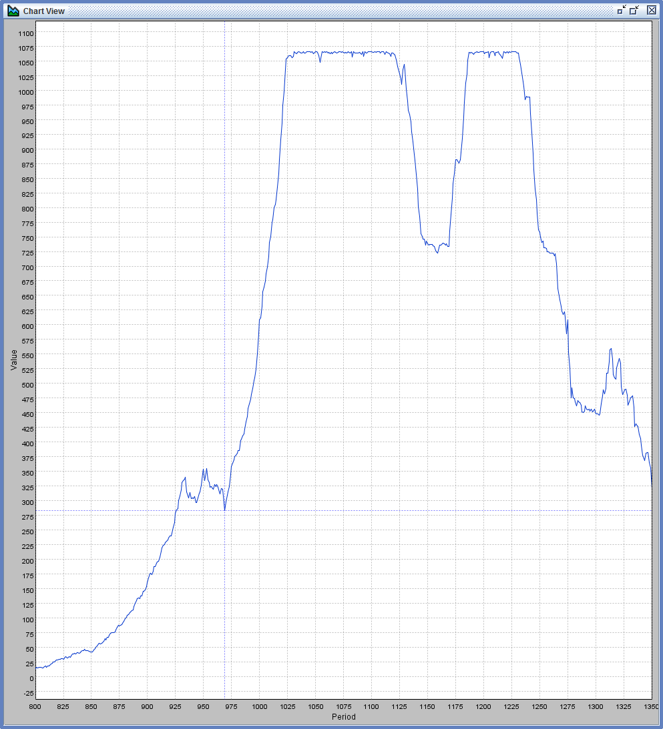

# Introduction to Agent-Based Modeling
Jonathan Gilligan  

#  Who Are You? {#who-sec data-transition="fade-out" data-state="skip_slide"}

## Who Are You?

 1. Who are you? (Name, year, major)
 2. Computational skills (if any)
      - programming, statistical analysis, ...
 3. What do you want to get from this class?
 4. Ask me a question about computational modeling
 5. Something interesting about yourself
 
# Getting Started {#started-sec data-transition="fade-out" data-state="skip_slide"}

## Getting Started {#started data-transition="fade-in"}

For Thursday:

* Download and install NetLogo on your computer.
    - URL in syllabus and assignment sheet
* Set up Box account
    - Details in syllabus and assignment sheet
    - <https://vanderbilt.box.com>
    - Make folder for this class with your last name:
        - lastname_EES_4760 or lastname_EES_5760
        - Share it with me and Brandt Gibson as Editors
        - Homework goes in subfolders:
            - HW_1, HW_2, ...

# Agent-Based Modeling {#abm-sec data-transition="fade-out" data-state="skip_slide"}

## Agent-Based Modeling {#abm data-transition="fade-in"}

* Simulate individuals:
    * Autonomous
    * Heterogeneous
    * Quasi-local
    * Bounded rationality
* Simulate environment
* Emphasize simplicity, minimal assumptions
* **Emergence:** Large-scale phenomena arise from small-scale individual interactions
    * Interesting when large-scale is not easily predicted from small-scale

## Simple Experiments

* Play with economics
    * Simple agents trade with each other
    * Confirm 1^st^ welfare theorem:
    
      Trading leads to Pareto equilibrium
    
    * Find conditions for satisfying theorem:
        * Not necessary for traders to be completely rational
            * How much rationality do you need?
        * Equilibration can be slow
        * Time-varying preferences can prevent equilibration
* Dynamics of agent-based models connect to nonlinear dynamics and chaos

## Economics of Cooperation

### Game Theory

* Prisoner's Dilemma Game:

    |   A \\ B   | **B Cooperates** | **B Defects**   |
    |:---------:|:---------:|:--------:|
    | **A Cooperates** | (3,3)     | (0,4)    |
    | **A Defects**    | (4,0)     | (1,1)    |

* Nash Equilibrium:
    * No matter what player A does, player B is better off defecting
    * No matter what player B does, player A is better off defecting
    * **End result:** Both players end up worse off than if they had both cooperated.

## Iterated Prisoner's Dilemma

> * R. Axelrod (1981)
> * Tournament of algorithms
> * Winner: "tit-for-tat"
> * Evolutionary Game Theory:
>       * Basic principles of good strategies:
>            * Be nice
>            * Be provocable
>            * Don't be too envious
>            * Don't be too clever
> * Nay & Gilligan (2015)
>     * Real-world strategies involve randomness, unpredictability

# Artificial Anasazi {#anasazi-sec data-transition="fade-out" data-state="skip_slide"}

## Example: Artificial Anasazi {#anasazi-intro data-transition="fade-in"}

### Axtell, Dean, Epstein, *et al.*

{height=800}

Long House Valley (flourished ca. 1800 BCE--1300 CE)

## Modeling Environment {#anasazi-modeling-environment}

{width=1800}

<!--- ---> {#anasazi-paleoclimate data-background="assets/images/paleoclimate.png" data-background-size="100% 100%"}
-------- 

## Constructing model {#constructing-anasazi-model}

* Paleoclimate:
    * Assess different kinds of soil
    * Assess tree rings, pollen, etc.
    * Reconstruct drought severity index
* Society:
    * Archaeology gives #, location of households
* Make assumptions about:
    * \# people per household,
    * Agriculture,
    * ...
* Devise rules for behavior:
    * Marriage, reproduction, migration, ...
* Simulate years 800--1300

## Results {#anasazi-initial-results}

{height=900}

## Comparison {#anasazi-results-comparison}

| Simulated | Historical |
|:---------:|:----------:|
| {width=900} |  {width=900} |

## Improvements {#anasazi-improvements}

* Make agents heterogeneous
* Fit parameters to historical data

## Results {#anasazi-improved-results}

{height=900}
