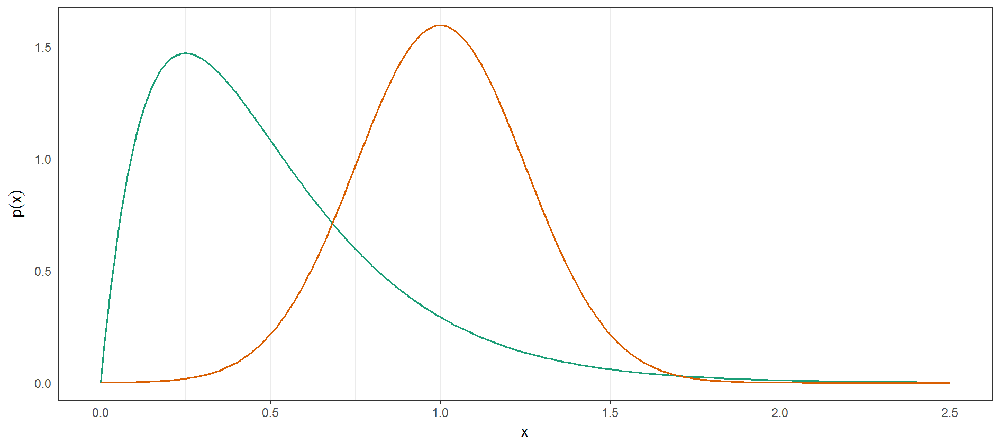
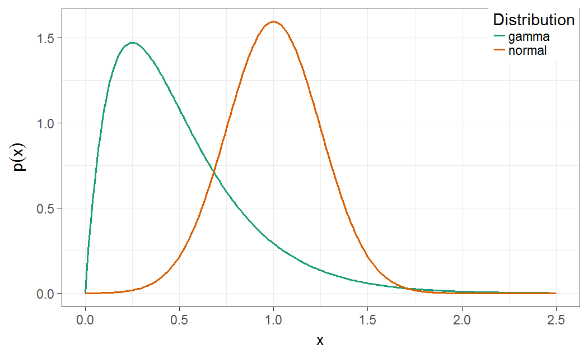

# Stochasticity
Jonathan Gilligan  

# Stochasticity {#stochasticity-sec data-transition="fade-out" data-state="skip_slide"}
## Stochasticity: {#stochasticity-sec data-transition="fade-in"}

### Why do we use random numbers?

> * To "inject ignorance" into a model:
>     * We want to represent some kind of variability *but*
>     * We do not want all the details of what causes the variability
           ```
           ask patches [set profit 1000 + (random 1000)]
           ask turtles [ if random-float 1.0 < mortality-prob [die] ]
           ```

## Common uses of stochasticity

* Initialization
    ```
    set fish-length random-normal 50 length-std-dev          
    ```
* In submodels
    ```
    ifelse random-float 1.0 < q
    [ uphill elevation ]
    [ move-to one-of neighbors ]
    ```

## Guidance for Stochasticity

> * **Do** use stochasticity to initialize model differently on different runs
>     * Makes sure that effects you see are not *artifacts* of a specific initialization
> * **Do** use stochasticity to simplify representation of very complex processes
>     * If wild dogs live an average of 5 years:
>          * instead of a detailed submodel 
>            that determines exactly when each dog will die, 
>          * let dogs die at random with a 20% probability of dying each tick.
> * **Don't** use too much stochasticity
>     * If you put too many different sources of randomness into your models
        every run may be *so different* you can't discover any general properties.

# Distributions {#distribution-sec data-transition="fade-out" data-state="skip_slide"}

## What is a Distribution? {#distributions data-transition="fade"}




## What is a Distribution?  {#distributions-2 data-transition="fade-in"}

* In simulation programming, an algorithm that produces (pseudo)random 
  numbers that fit a particular statistical distribution.
  
    ```
    let x1 random-normal 1.0  0.25
    let x2 random-gamma  2.0  4.0
    ```




## Distributions in NetLogo

* Continuous (real-number)
    * Uniform: <code>random-float <i>upper-limit</i></code>
    * Normal: <code>random-normal <i>mean</i> <i>sd</i></code>  (beware of outliers)
    * Also: `random-gamma`, `random-exponential`
* Discrete (integer):
    * Uniform: <code>random <i>upper-limit</i></code>
        * 0 to <code><i>upper-limit</i> - 1</code>
    * Poisson: <code>random-poisson <i>mean</i></code>
        * `mean` = average value
    * Bernoulli (`true` or `false`): `random-float 1.0 < p`
        * `true` with probability `p`
        * See `random-bernoulli` reporter on p. 200 of the textbook.

# Controlling randomness {#controlling-sec data-transition="fade-out" data-state="skip_slide"}

## Controlling randomness {#controlling data-transition="fade"}


* `random-seed` _number_
    * As long as _number_ is the same, you get the same sequence 
      of random numbers
  
        ```
        to setup
            clear-all
            random-seed 32149
            ...
        end
        ```

## Controlling randomness {#controlling-2 data-transition="fade-in"}

* `with-local-randomness [ commands ]`<br/>
  Runs without changing sequence of random numbers in other parts of the model
  
    ```
    to move
      with-local-randomness
      [
        random-seed 63592
        ...
      ]
    end
    ```

## How can we see a distribution?

* Histograms

    ```
    to plot-histogram-normal
      clear-all
      set-plot-pen-mode 1 ; bar mode
      set-plot-pen-interval 0.1
      set-plot-x-range -1 3
      let x (list)
      ; fill x with 5000 random numbers from a normal distribution        
      repeat 5000 [ set x fput (random-normal 1.0 0.25) x]      
      histogram x
    end
    ````

{height=300}

## Uniform distributions

* Integer: `random n` gives an integer $i$: $0 \le i < n$
    * From 0 to $(n - 1)$
* Continuous: `random-float z` gives a number $x$: $0 \le x < z$
    * Should we worry that $x < z$?
    
        ```
        to test
          let num_draws 10000
          let max-rand 0
          repeat num_draws
          [
            let x random-float 1000
            if x > max-rand [ set max-rand x ]
          ]
          show max-rand
        end
        ```
        
        ```
        observer> test
        observer: 999.9869678378017
        ```

## Poisson distribution

* For countable things that happen at a small rate.
    * On every turn a random number of agents turn red,<br/>with an average of 5% of agents
        ```
        ask n-of (random-poisson (0.05 * count turtles)) turtles [set color red]        
        ```
        or
        ```
        let n random-poisson (0.05 * count turtles)
        ask n-of n turtles [set color red]
        ```

## Normal distribution

* For measurable things with an average value

    ```
    set weight random-normal 150 20  ; weight in pounds       
    set height random-normal 70 2    ; height in inches
    ```

# Stochastic Business Investors {#stochastic-investors .center}

## Stochastic Business Investors {.leftslide .ninety}

Model: <https://ees4760.jonathangilligan.org/models/class_19/business_investor_class_19.nlogo>

### Original model: {style="padding-top:50px;"}


Investors move to neighbor with highest expected utility (including own patch)

Average over 10,000 runs:

| Alternative | Frequency |
|:-----------:|----------:|
| Higher profit, lower risk | 83.3% |
| Higher profit, higher risk | 5.4% |
| Lower profit, lower risk | 4.9% |
| Lower profit, higher risk | 0% |
| Don't move | 92.7% |

* Mean wealth = $128,400
* Total wealth = $12,000,000

## Stochastic Model

### Original model:

| Alternative | Frequency |
|:-----------:|----------:|
| Higher profit, lower risk | 83.3% |
| Higher profit, higher risk | 5.4% |
| Lower profit, lower risk | 4.9% |
| Lower profit, higher risk | 0% |
| Don't move | 92.7% |


### Stochastic model {style="padding-top:50px;"}

* If there are neighbors with higher profit and lower risk:
    * 83.3% probability of moving to one of them
* Otherwise, if there are neighbors with higher profit and higher risk:
    * 5.4% probability of moving to one of them
* etc.

## Compare models:

### Original model: {style="padding-top:50px;"}

| Alternative | Frequency |
|:-----------:|----------:|
| Higher profit, lower risk | 83.3% |
| Higher profit, higher risk | 5.4% |
| Lower profit, lower risk | 4.9% |
| Lower profit, higher risk | 0% |
| Don't move | 92.7% |

* Mean wealth = $128,400
* Total wealth = $12,000,000

### Stochastic model: {style="padding-top:50px;"}

???
