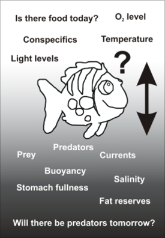

```{r utility_functions, cache = F, echo = F, eval = T, message=F, warning=F}
knitr::opts_chunk$set(cache=TRUE, echo=FALSE, message=FALSE, warming=FALSE,
                      fig.height=8.5, fig.width=14, dpi=100,
                      dev='png',fig.path='assets/fig/',cache.path='./cache/')

find_semester_dir <- function(p = NULL) {
  if (is.null(p)) p <- getwd()
  p <- normalizePath(p)
  if (file.exists(file.path(p,'semester.yml'))) {
    return(p)
  } else {
    d <- dirname(p)
    if (d == p) return(NA)
    return(find_semester_dir(d))
  }
}

semester.dir <- find_semester_dir()
data.dir <- file.path(semester.dir, 'data')
script.dir <- file.path(semester.dir,'util_scripts')

source_semester_script <- function(script) {
  script_file <- file.path(script.dir, script)
  message("Running script", script_file)
  source(script_file, chdir = T)
}

eval_in_sem_script_dir <- function(expr, loc = script.dir) {
  this.dir <- getwd()
  setwd(loc)
  retval <- eval(expr)
  setwd(this.dir)
  invisible(retval)
}

library(tidyverse)
library(magrittr)
```
## Agenda {#agenda}

<style>
.reveal .stretch code { max-height:100%; }
</style>

1. Understanding structure of NetLogo models
1. Elementary NetLogo commands
1. Some principles of good programming
1. Overview of agent-based modeling

<hr/>

Start NetLogo on the computer in front of you.

<hr/>

Remember: All slides from class are posted at 
<https://www.ees4760.jgilligan.org/schedule/>

# Fundamentals of NetLogo {#fundamentals-sec .center}

## Four Fundamental Code Parts {#code-sections}

<table style="vertical-align:middle;">
<tbody>
<tr>
<td  style="border:1px solid blue;width:50%;vertical-align:middle;">

```
globals []
turtles-own []
breed [wolves wolf]
```

</td>
<td  style="border:1px solid blue;vertical-align:middle;">

1. Declaration of variables and collectives

</td>
</tr>
<tr>
<td  style="border:1 blue solid;vertical-align:middle;">

```
to setup
   clear-all
    ask patches [ do-something ]
    ask turtles [ do-something ]
    reset-ticks
end
```

</td>
<td  style="border:1px solid blue;vertical-align:middle;">

2. Model initialization

</td>
</tr>
<tr>
<td  style="border:1px solid blue;vertical-align:middle;">

```
to go
    ask patches [ do-something ]
    ask turtles [ do-something ]
    tick
end
```

</td>
<td  style="border:1px solid blue;vertical-align:middle;">

3. Scheduled actions (tick)

</td>
</tr>
<tr>
<td  style="border:1px solid blue;vertical-align:middle;">

```
to do-something-special
  ...
end

to do-something-boring
  ...
end
```

</td>
<td  style="border:1px solid blue;vertical-align:middle;">

4. Submodels (science and cosmetics)

</td>
</tr>
</tbody>
</table>

## Objects (Nouns) {#objects .seventy}

Three categories of objects:

1. Turtles
    * Turtles are any kind of agent
    * Turtles can move around
    * Turtles have properties (`turtles-own`)
      ```
      turtles-own [ age height hunger ]
      ```
    * Your model can have more than one "breed" of turtle (e.g., wolves and sheep)
      ```
      breed [wolves wolf]
      breed [sheeps sheep] ; names must be distinct
      ```
1. Patches
    * Patches represent the environment in which turtles live
    * Patches are always square and stationary
    * Like turtles, patches can have properties `patches-own`
      ```
      patches-own [ elevation fertility ]
      ```

1. Links
    * Links connect turtles
    * We will encounter these later in the semester.

## Operations (Verbs) {#operations}

Two kinds of operations:

1. Procedures
    * Do things (eat, move, grow, buy, sell, ...)
    * Defined using `to`:
      ```
      to wander
          right random 360
          forward random 5
      end
      ```
1. Reporters
    * Calculate something and return a value
    * Defined using `to-report`:
      ```
      to-report turtles-nearby
         report count turtles-on neighbors
      end
      ```

# Let's Build A Model! {#lets-build-a-model .center}

## A Simple Model of an Ecosystem {#simple-model}

* The landscape is initialized with random amounts of sugar on each patch
* 100 turtles live on the landscape
* At each tick:
    * Every patch adds 0.075 to its sugar up to a maximum of 100
    * Every turtle's hunger increases by 1, up to a maximum of 10
    * Every turtle eats sugar until it is no longer hungry, or the sugar on 
      that patch runs out
    * The turtle decides whether it wants to move:
        * If there are other turtles on the patch, or if there is not enough 
          sugar on the patch to satisfy its hunger, then the turtle will move 
          to the neighboring patch with the largest amount of sugar.


## Create a New Model {#begin-new-model}

* In NetLogo, open **File** menu and choose **New**
* Add three buttons:
    * "setup" (type "setup" in "Commands" space)
    * "go" (check the "forever" button)
    * "step" (type "go" in "Commands" space and "step" in "Display Name")
    
* Go to the code tab and type this:

```
globals 
[ 
  max-sugar 
  sugar-growth 
]
turtles-own [ hunger ]
patches-own [ sugar ]
```
    

## Model Initialization (`setup`) {#initialization}

<table style="vertical-align:middle;margin-top:70px;">
<tbody>
<tr>
<td  style="width:50%;vertical-align:top;">
Include <b>only things done once</b> to initialize the model
</td>
<td  style="border:1px solid blue;box-shadow 0 0;vertical-align:top;">

### Example:

| `clear-all`
| _setup patch variables_
| _paint patches in neat colors_
| `create turtles`
| _setup turtle variables, etc._
| _plot initial model state (histograms, etc.)_
| `reset-ticks`

</td>
</tr>
</tbody>
</table>

## Initialize Your Model {#initialize-class-model .eighty}

Type this into the code tab for your model:

<div class="stretch">

```
to setup
  clear-all
  
  set sugar-growth 0.075
  set max-sugar 100
  
  ask patches 
  [ 
    set sugar random max-sugar 
    update-pcolor
  ]
  
  create-turtles 100 
  [ 
    setxy random-xcor random-ycor 
    set hunger 5
    update-color
  ]
  reset-ticks
end

to update-color
end

to update-pcolor
end
```

</div>

## Scheduled Actions (`go`) {#go-procedure}


<table style="vertical-align:middle;margin-top:70px;">
<tbody>
<tr>
<td  style="width:50%;vertical-align:top;">

* "go" is repeated over and over to execute model.
* Include **only** stuff to be executed **each time step**
* Keep the "go" procedure simple and neat
    * For complicated stuff, call submodels
* Include termination point

</td>
<td  style="vertical-align:top;">

<div class="stretch">

Type this into your model:

```
to go
  tick
  ask turtles [ 
    if hunger < 10 [ set hunger hunger + 1 ]
    eat
    move
    update-color
    ]
  ask patches 
  [
    if sugar < max-sugar [ set sugar sugar + sugar-growth ]  
    update-pcolor 
   ]
   if ticks > 2000 [ stop ]
end

;
; Submodels
;

to eat
end

to move
end
```

</div>

</td>
</tr>
</tbody>
</table>


# Tricky Things {#tricky-sec .center}

## `tick` vs. `ticks` {#tick-vs-ticks}

* `tick` --- (verb) increments time by one period
* `ticks` --- (noun) measures the time elapsed since the start

* More technical explanation:
    * NetLogo has an internal tick counter
        * `tick`  increments the tick counter
        * `ticks` reports the current value of the tick counter

## `tick` vs. `ticks` {#tick-vs-ticks-2}

<table style="margin-top:70px;width:100%;">
<tbody>
<tr>
<td  style="width:50%;vertical-align:top;border:1px solid blue;">
Good code:

```
to go
    tick
  
    if ticks > max-ticks
        [stop]
    ...
    ask turtles [set age ticks]
end
```

</td>
<td  style="vertical-align:top;border:1px solid blue;">
Bad code:

```
to go
    ticks
  
    if tick > max-ticks
        [stop]
    ...
    ask turtles 
        [
            tick
            set age ticks
        ]
end
```

</td>
</tr>
</tbody>
</table>

# Elementary NetLogo Commands {#commands-sec data-transition="fade-out" data-state="skip_slide"}

## Elementary NetLogo Commands {#commands data-transition="fade-in"}


A.  Searching NetLogo dictionary
B.  Working with `agentsets`
C.  Working with variables
D.  Code branching (conditional statements)
E.  Working with stochasticity
F.  Working with graphics
G.  How to make your code legible to others (documentation, comments, and tabbing)


## Searching NetLogo Dictionary {#netlogo-dictionary}

* NetLogo dictionary is a web page
* Use "Find on this page" in your web browser.

## Working with agentsets (`ask`) {#ask}

* An agentset is a group of zero or more turtles, patches, etc.
  * Plural nouns (`turtles`, `patches`) refer to agentsets.
  * Singular nouns (`turtle`, `patch`) refer to individual agents.
* "`ask`" tells an agent or all members of an agentset to do the code in the following brackets:

  ```
  ask turtles [ forward 5 ]
  ```

* All members of the agentset do the code, one at a time
* Be careful not to put anything in the brackets that should not be repeated for each member of the agentset!

## How are these different? {#ask-scheduling}

<table class="noborder" style="margin-top:70px;width:100%;">
<tbody>
<tr>
<td  style="width:50%;vertical-align:top;border:1px solid blue;">

```
ask turtles
    [ 
        buy
        sell
        update-bank-account
    ]
```

</td>
<td  style="vertical-align:top;border:1px solid blue;">

```
ask turtles [buy]
ask turtles [sell]
ask turtles [update-bank-account]
```

</td>
</tr>
</tbody>
</table>

## Working with agentsets (`with`) {#with}

* `turtles` is an agentset of all turtles.

* "`with`" is one of many primitives that subset an agentset:
  ```
  ask turtles with [color = blue] [move]
  ```

* Similar keywords for sub-setting:<br/>
  `with-min`, `with-max`,<br/>
  `n-of`, `max-n-of`, `min-n-of`,<br/>
  `one-of`, `max-one-of`, `min-one-of`

* Use the dictionary to look up correct syntax.

## Working with agentsets (`of`) {#of}

* "`of`" provides a *list* of the values of an `-own` variable

    `set happiness min [happiness] of neighbors`

* More generally, "`of`" is a primitive for getting a value from *another* agent or agents

    `set happiness [happiness] of a-neighbor-turtle`

* Use the dictionary to look up correct syntax.

## Add Movement to Our Model {#to-move}

```
to move
  if hunger > sugar 
  [
    move-to max-one-of neighbors [ sugar ]
  ]
end
```

If there isn't enough sugar to satisfy the turtle, it moves to the 
neighboring patch with the most sugar.

## Working with agentsets (`=`, `set`) {#set-vs-equals}

* Two fundamental kinds of operations:
    * Changing the value of a variable:
        * Assignment operations (`set`)
    * Checking to see whether a value satisfies some condition:
        * Conditional operations (`=`, also `>`, `<`, `>=`, `<=`, `!=`)


## Equals or no equals? {#compare-or-assign}

<table class="noborder" style="margin-top:70px;width:100%;">
<tbody>
<tr>
<td  style="width:50%;vertical-align:top;border:1px solid blue;">
Assignment statements

* Wrong:

```
happiness = ([happiness] of a-neighbor-turtle)
```

* Right:

```
set happiness ([happiness] of a-neighbor-turtle)
```

</td>
<td  class="fragment" style="width:50%;vertical-align:top;border:1px solid blue;">
Conditional statements (Boolean: yes or no)

```
if happiness = 3
    [stop]
    
if happiness <= 3
    [stop]
    
if happiness != 5 or ticks > 17
    [stop]
```

</td>
</tr>
</tbody>
</table>


## Working with variables: `set` vs. `let` {#set-vs-let}

* Global variables (known to all procedures)
* Local variables (known only to one procedure)

* Use `let` to *create* and *set the value* of a new local variable:

  ```
  let mean-neighbor-size mean [size] of turtles-on neighbors
  ```

* Use `set` to change the value of an existing variable (global, local, patch, turtle, etc.)

  ```
  set wealth wealth * 1.1
      
  set hypotenuse sqrt(a ^ 2 + b ^ 2)
  ```

## Working On Our Model {#to-eat .ninety}

Type this into "code" tab to update `to eat` and `to move` in our model:

<div class="stretch">

```
to eat
  ifelse hunger > sugar 
  [
    ; Use set to change an existing variable "hunger"
    set hunger hunger - sugar
    set sugar 0
  ]
  [
    set sugar sugar - hunger
    set hunger 0
  ]
end

to move
  if hunger > sugar or any? turtles-here 
  [
    ; Use let to create a new variable "dest"
    let dest max-one-of neighbors [ sugar ]
    move-to dest
  ]
end
```

</div>

## Working with variables: Giving a value to another agent {#assigning-agent-variables}

* How does one patch (or turtle) give the value of one of its variables to other patches?
    * There are two ways to do this.

```
ask neighbors [set pcolor [pcolor] of myself]
```

```
let my-color pcolor
ask neighbors [set pcolor mycolor]
```

> * Turtles implicitly access `patches-own` variables (e.g., `pcolor`, `sugar`) 
  of the patch they're on as though they were `turtles-own`
> * Converse is not true: Patches don't automatically see `turtles-own`
> * Why?
>     * A turtle can only be on one patch at a time,
>     * but a patch may have multiple turtles.

## Code branching (conditional statements) {#branching}

```
ifelse (boolean condition)
  [
  ; Do this if condition is true ...
  ]
  [  ;else
  ; Do this if condition is false
  ]
```

## Working with stochasticity (randomness) {#stochasticity}

* Uniform distribution of random numbers between `a` and `b`:

  ```
  a + random (b-a)
  ```

* Normal distribution with mean `m` and std. deviation `s`:

  ```
  random-normal m s
  ```

* Selecting one patch at random and turn it green

  ```
  ask one-of patches [set pcolor green]
  ```

* Selecting one agent at random from an agentset and turn it right 5 degrees:

  ```
  ask one-of turtles [right 5]
  ```

## Working with graphics {#graphics}

{height=800}

## Updating Our Model {#adding-color-to-model}

Type the following into the "code" tab to update the procedures<br/> 
`update-pcolor` and `update-color`

<div class="stretch">

```
to update-pcolor
  set pcolor scale-color yellow sugar 0 (2 * max-sugar) 
end

to update-color
  ifelse hunger > 5
  [
    set color scale-color red hunger 15 5
  ]
  [
    set color scale-color green hunger 5 -5
  ]
end
```

</div>


* `scale-color color number range1 range2` sets the lightness of the color. Higher numbers = lighter, lower = darker.
* If `range1 > range2`, light and dark are reversed.

## Running Our Model {#running-class-model}

* Press "Check" and make sure there are no syntax errors
* Go to "Interface" tab
* Click on "setup"
* Click on "go"
* You can download a copy of the model from <https://ees4760.jgilligan.org/models/class_03_example.nlogo>

## Monitoring and Interacting with a Model {#monitoring-interacting .seventy .leftslide}

::::::::: {.columns}
:::::: {.column style="width:49%;"}

On the "interface" tab:

::: {style="text-align:left;"}

* Right click and add a Plot
  * Name the plot "Hunger"
  * Set X max to 10 and Y max to 100
  * Type "Hunger" for "X axis label" and "# Turtles" for "Y axis label"
  * Click on the pencil icon under "default" pen
    * Choose "Bar" for "Mode"
    * In "Pen update commands" type `histogram [hunger] of turtles`
  * Press "OK"

:::
::: {.fragment style="text-align:left;"}

* Right click and add a Slider
  * Type "sugar-growth" into "Global Variable"
  * Set minimum to 0, increment to 0.005, maximum to 0.1, and value to 0.075

:::
::::::

::::::: {.column style="width:49%;vertical-align:top;padding-top:2em;"}

::: {.fragment style="text-align:left;"}

* Open the code tab and comment out definition and initialization of `sugar-growth`

```
globals
[
  max-sugar
  ; sugar-growth
]
...
to setup
  clear-all
  ; set sugar-growth 0.075
  ...
```

:::
::::::
:::::::::

## Play with the model {#model-play}

* Do interesting things happen for different values of `sugar-growth`?
* It might be fun to comment out the line in `to go` that stops the model 
  after 2000 ticks

```
  ; if ticks > 2000 [ stop ]
```


# Good Practices for Programming {#good-practice-sec .center}

## Making your code legible to other people {#making-code-legible}

1. Comment, comment, comment.
   * Variable declaration: purpose, legal values
   * Procedure: purpose and description
   * Submodel equations: cite and explain
2. Indent code so it shows clear blocks
3. After you're finished coding, take time to write detailed documentation (ODD)

## When in doubt, use this. {#netlogo-dictionary-1}

{height=800}


# Agent-Based Models {#ABM-sec data-transition="fade-out" data-state="skip_slide"}

## Agent-based models {#ABMs data-transition="fade-in"}

* Agents/Individuals are discrete, unique, and autonomous entities.

* Discrete entities: Important at low densities
* Unique: Individuals, even of same age and species, can be **different**
* Individuals have a **life history**
* Interactions among individuals are usually **local**, not global
* Individuals make decisions, which can be **adaptive**
* Ecology or society **emerges** from individual behavior (bottom-up)

## Why agent-based models? {#why-ABMs}

1. Individuals/agents are unique and different
2. Individuals/agents interact locally
3. Individuals/agents show adaptive behavior

## Why agent-based models? {#why-ABMs-2 .leftslide}

<div style="text-align:left;">

Use ABM if *one or more* of the following are **essential** to your research question:


1. Individual variability
2. Local interactions
3. Adaptive behavior

<div style="padding-top:50px;">
</div>


* ABMs that include all three elements can be called **full-fledged**. 
* Most ABMs focus on only one or two elements.


</div>

## Why **not** agent-based models? {#why-not-ABMs}

<div style="text-align:left;">

* Too complex
* Too data hungry.
* Too many parameters unknown.
* Too much uncertainty in model structure.
* Hard to test.
* Require too much person and computer power.

</div>

. . .


<div style="text-align:left;">

When ABMs are too hard, use aggregated modeling techniques: 

</div>

. . .

<div style="text-align:left;">

* Microeconomics looks at aggregate supply and demand; 
  * does not model individual consumers and producers.
* Biology can use population dynamics without looking at individuals
* Chemists model chemical reactions with rate constants, 
    * not individual atoms and molecules.

</div>

## Individual variability {#heterogeneity}

{style="width:45%;"}
{style="width:45%;"}

<span style="font-size:50%;color:#C0C0C0;">From Huston, M., *et al.*, BioScience **38**, 682 (1988)</span>

## Adaptive behavior {#adaptive-behavior}

{height=800}

## Adaptive behavior:<br/>Characteristic patterns in trout habitat selection {#adaptive-trout .eightyfive}

{height=800}


## Adaptive behavior:<br/>Characteristic patterns in trout habitat selection {#trout-habitat-selection .eightyfive}

* Use of shallow habitat when small; deep habitat when big
* Shift in habitat when predators, larger competitors are introduced
* Hierarchical feeding: big guys get the best spots
* Movement to margins during floods
* Use of slower, quieter habitat in high turbidity
* Use of lower velocities at lower temperatures

Source: Railsback and Harvey, 2002.

## Example: flocks of starlings {#realistic-starling-flocking}

* Thousands of individuals
  * unique and different
  * interact locally
  * show adaptive behavior

{height=600}

## Flock of thousands of starlings {#starling-movie}

<video width="960" height="720" controls>
  <source src="assets/video/MovieS6.mp4" type="video/mp4">
Your browser does not support the video tag.<br/>
You can play the video at 
<a href="https://ees4760.jonathangilligan.org/Slides/Class_03/assets/video/MovieS6.mp4">https://ees4760.jonathangilligan.org/Slides/Class_03/assets/video/MovieS6.mp4</a>
</video> 


## Simulated flock of thousands of starlings {#starling-model}

<video width="960" height="720" controls>
  <source src="assets/video/MovieS1.mp4" type="video/mp4">
Your browser does not support the video tag.<br/>
You can play the video at 
<a href="https://ees4760.jonathangilligan.org/Slides/Class_03/assets/video/MovieS1.mp4">https://ees4760.jonathangilligan.org/Slides/Class_03/assets/video/MovieS1.mp4</a>
</video> 

## Simulated flock of thousands of starlings {#starling-model-2}

<video width="960" height="720" controls>
  <source src="assets/video/MovieS2.mp4" type="video/mp4">
Your browser does not support the video tag.<br/>
You can play the video at 
<a href="https://ees4760.jonathangilligan.org/Slides/Class_03/assets/video/MovieS2.mp4">https://ees4760.jonathangilligan.org/Slides/Class_03/assets/video/MovieS2.mp4</a>
</video> 
