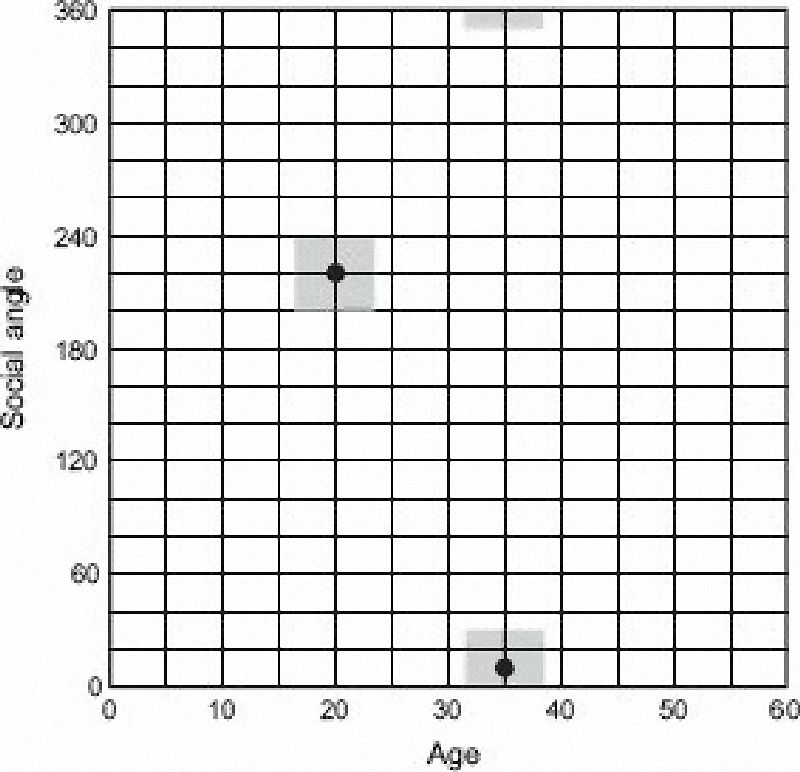

```{r utility_functions, cache = F, echo = F, eval = T, message=F, warning=F}
knitr::opts_chunk$set(cache=TRUE, echo=FALSE, message=FALSE, warming=FALSE,
                      fig.height=8.5, fig.width=14, dpi=100,
                      dev='png',fig.path='assets/fig/',cache.path='./cache/')

find_semester_dir <- function(p = NULL) {
  if (is.null(p)) p <- getwd()
  p <- normalizePath(p)
  if (file.exists(file.path(p,'semester.yml'))) {
    return(p)
  } else {
    d <- dirname(p)
    if (d == p) return(NA)
    return(find_semester_dir(d))
  }
}

semester.dir <- find_semester_dir()
data.dir <- file.path(semester.dir, 'data')
script.dir <- file.path(semester.dir,'util_scripts')

source_semester_script <- function(script) {
  script_file <- file.path(script.dir, script)
  message("Running script", script_file)
  source(script_file, chdir = T)
}

eval_in_sem_script_dir <- function(expr, loc = script.dir) {
  this.dir <- getwd()
  setwd(loc)
  retval <- eval(expr)
  setwd(this.dir)
  invisible(retval)
}

library(tidyverse)
library(magrittr)
```
# Organization {#org-sec data-transition="fade-out" data-state="skip_slide"}

## Organization {#organization data-transition="fade-in"}

:::::: {.leftlist}

* Download marriage model from Brighspace or class web page:
    * Marriage Model is at <https://ees4760.jgilligan.org/models/class_07/marriage_model.nlogo>
    * ODD is at <https://ees4760.jgilligan.org/models/class_07/MarriageAgeModel-ODD.pdf>

::: {.fragment style="padding-top:50px;"}

* Team Projects:
    * Class Presentations Feb. 27
    * Choice of two projects:
        * Adaptive behavior (Business investor model, Ch. 10)
        * Agent interactions (Telemarketer model, Ch. 13)
    * Decide which one you want to do and choose a partner
      <br/>(undergrads with undergrads, grads with grads)

:::
::::::

# Finding and Fixing Errors {#error-sec .center}

## Classes of Errors {#error-classes .eighty}

* Typographical (typing `pxcor` when you mean `pycor`)

* Syntax

* Misunderstanding NetLogo language:

  ::: {style="width:70%;"}
  ```
  ask turtle 5 [
    let neighbor-turtles turtles in-radius 2
    ask neighbor-turtles [set color green]
  ]
  ```
  :::
  
  versus
  
  ::: {style="width:80%;"}
  ```
  ask turtle 5 [
    let neighbor-turtles turtles-on patches in-radius 2
    ask neighbor-turtles [set color green]
  ]
  ```
  :::

* Wrong display settings (wrapping)

* Run-time errors (e.g., division by zero, moving turtle out of world
  <br/>forgetting to initialize globals,
  turtles-own, or patches-own)

* Logic errors [**(hard to find)**]{style="color:#0000A0;"}

* Formulation errors [**(hard to find)**]{style="color:#0000A0;"}

## Finding Errors {#finding-errors}

* Syntax checks
* Visual tests
* Print statements (highly recommended)
    * `print`, `show`, `type`, `write`, ...
    * `output-print`, `output-show`, ...  outputs to model output area instead of Command Center
    * `file-print`, `file-show`, ... outputs to a file. 
        * Must call `file-open` first
* Spot tests with monitors on interface
* Unit tests with `jg-tif.nls`


## Chasing Down Errors {#chasing}

* Stress tests 
    * Run with many different extreme values using unit tests
* Code reviews (teamwork)
* Statistical analysis of output
    * BehaviorSpace
    * `file-open`, `file-print`, ...
    * `export-plot`

## Independent Re-Implementation of Submodels {#re-implementation}

* If your model needs a tricky calculation:
    * Try it in another format: 
      spreadsheet, scripting language (Python, R, Matlab, etc.)
    * Compare to NetLogo results


# Marriage Model {#marriage-sec data-transition="fade-out" data-state="skip_slide"}

## Marriage Model ODD {#marriage-odd data-transition="fade-in"}

* **Purpose:** Describes social norms of age at which people marry
* **Entities, State-Variables, Scales:** Agents are individual people.
    * Age (0--60), sex, marital status
    * Social angle: describes location in social network
        * Social network like cylinder: coordinates are age and social angle

<!-- --> {#social-network}
------

{height=900}
