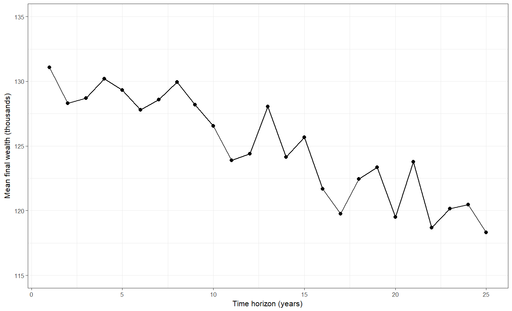
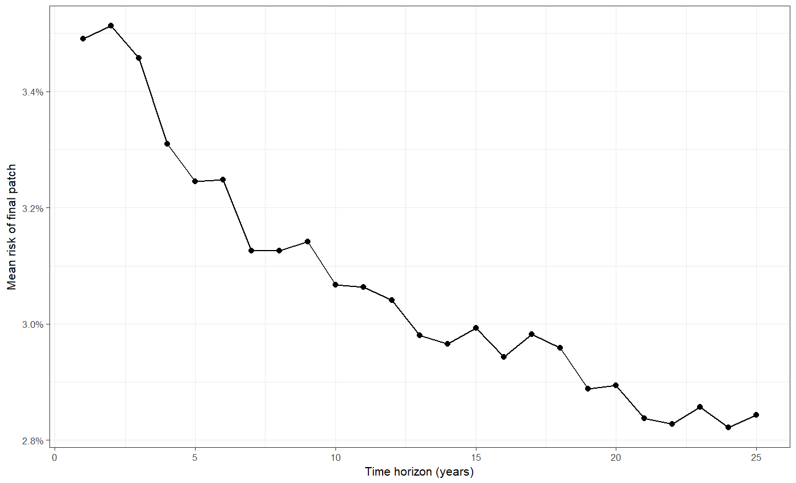

# Getting Started {.center}

## Getting Started  {.eighty}

Download

* <https://ees4760.jgilligan.org/models/class_13/BusinessInvestor.nlogo>
* <https://ees4760.jgilligan.org/models/class_13/BusinessInvestor_satisfice.nlogo>
* <https://ees4760.jgilligan.org/models/class_13/BusinessInvestor_bayesian.nlogo>
* <https://ees4760.jgilligan.org/models/class_13/jg-tif.nls>

# Prediction {.center}

## Prediction

> * What do investors want?
>   * Maximize their wealth over time
> * How do investors decide what patch to move to?
>   * _Predict_ what their wealth is likely to be after a certain number of
      ticks on each square.
      $$ U = (W + P \times T) \times (1 - F)^T $$
> * Farmer planting crops
>   * Predict what weather will be
>   * Predict what crops will be in demand at end of season
>   * Past experience, statistical analysis, ...
> * Predator chasing prey
>   * Predict where prey will be in order to intercept
>   * Extrapolate from current position, velocity ...

## Modeling Prediction

* Sensing: What do agents know?
* Cognition: How do agents think?
* Learning: Do agents learn from experience?

## Business Investor

> * How does agent decide how far into the future to try to predict expected utility?
> * How does this time horizon affect behaviors and outcomes?

. . .

* Interactive app <https://alo.ees.vanderbilt.edu/shiny/ees4760/contour/>

<iframe height=450 width=1800 src="https://alo.ees.vanderbilt.edu/shiny/ees4760/contour/">
Open app at <https://alo.ees.vanderbilt.edu/shiny/ees4760/contour/>
</iframe>

## Varying Time Horizon: Wealth

## Varying Time Horizon: Failures

## Varying Time Horizon: Profit

## Varying Time Horizon: Risk

# Modeling Prediction {.center}

## Investor Ignorance {.eighty}

> * Suppose the investor does not know risks of failure?
> * Learn about risk from experience
> * Bayesian updating:
>   * Start assuming that each patch has same risk (average)
>   * Each turn investors get new information about failures
>   * _beta_ function:
      $$F_{\text{est}} = \frac{\alpha}{\alpha + \beta}$$
      What are $\alpha$ and $\beta$?
>   * $\alpha$ represents number of failures on a patch
>   * $\beta$ represents number of non-failures
>   * Initial guess:
      $$\begin{aligned}
      \alpha &= (R^2 - R^3 - RV) / V\\
      \beta &= (R/V) (1 - R^2) + (R - 1),
      \end{aligned}$$
      where $R$ is the average risk across patches and
      $V$ is the variance of risk across patches.
>   * Every tick, increment $\alpha$ for patches with failures and increment
      $\beta$ for patches without failures.

## Experiment

* Open `BusinessInvestor_bayesian.nlogo`
