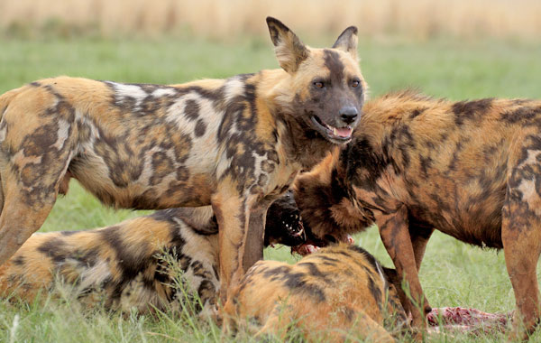
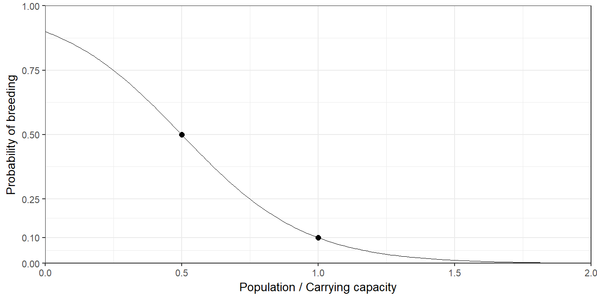
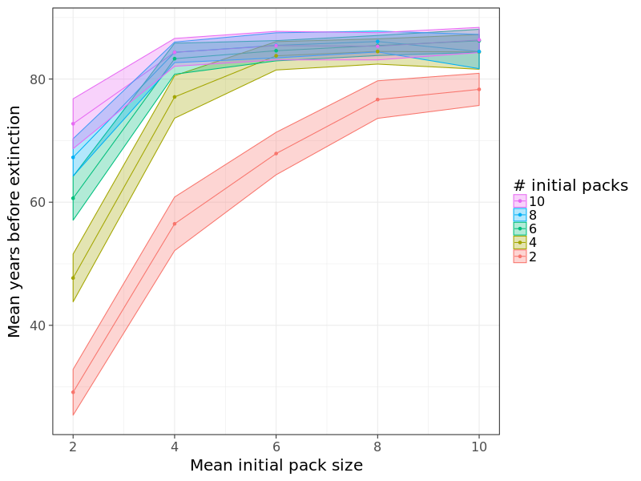
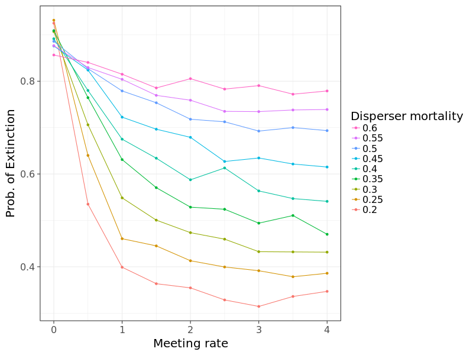

## Wild Dog Model {#initial-downloads .center}

* Download Page: 
  * [ees4760.jgilligan.org/downloads/collectives_class_19/](/downloads/collectives_class_19/)
* Zip File:
  * [class_19_models.zip](/models/class_19/class_19_models.zip), which contains:
* Individual files:
  * NetLogo model: [wild_dogs.nlogo](/models/class_19/wild_dogs.nlogo)
  * Testing library: [jg-tif.nls](/models/class_19/jg-tif.nls)
  * ODD:  [wild_dog_odd.pdf](/models/class_19/wild_dog_odd.pdf)


# Breeds of Turtles {#breed-sec data-transition="fade-out" data-state="skip_slide"}

## Breeds of Turtles {#breeds data-transition="fade-in"}

```
breed [dogs dog]
breed [cats cat]

globals []

turtles-own
[
  sex
  age
]

dogs-own
[
  has-ball?
]

cats-own
[
  has-scratching-post?
  claw-length
]
```

## Breeds and Contexts

* All breeds are evaluated in turtle context.

```
to go
  tick
  
  ask turtles [ set age age + 1 ]
  ask dogs [ if has-ball? [ fetch ] ]
  ask cats [ if has-scratching-post? [ scratch ] ]
  ask turtles [
    ; this will make an error
    if has-scratching-post? [ scratch ]
  ]
end
```

* Common error: Ask one breed (wolf) to do another breed's (sheep's) function.


## Checking for Errors:

Good idea: Check that the right breed is calling the function:

```
to do-cat-stuff
  if not is-cat? self 
  [
    print (word "Error: turtle " self " is not a cat.")
    stop
  ]
  
  if has-scratching-post? [ scratch ]
end
```

Or, if you're using `jg-tif.nls`, you can do this:

```
to do-cat-stuff
  test-that (word "do-cat-stuff: turtle " self " should be a cat.")
  expect-that is-cat? self is-true
  
  if has-scratching-post? [ scratch ]
end
```

## Turtles vs. Breeds

* If you have breeds, there will still always be `turtles`. 

* `ask turtles [...]` will ask all breeds of turtle.

* `ask dogs [...]` will only ask the dogs.

* Many `turtles-` commands have a breed-specific version:
  ```
  if any? turtles-here
  [
    ask turtles-here [forward 10]
  ]
  
  if any? dogs-on neighbors and any? cats in-radius 5 
  [
    ask dogs-on neighbors
    [
    chase min-one-of cats [distance myself]
    ]
  ]
  ```

## Breeds of links

* Links can also have breeds.
  ```
  undirected-link-breed [friendships friendship]   ; between friends
  directed-link-breed [children-of child-of]       ; from parent to children          
  directed-link-breed [employees employee]         ; from boss to employees
  
  to befriend [ new-friend ]
    create-friendship-with new-friend ; create friendship
  end
  
  to spawn [ n ] ; executed in context of parent
    hatch n [ 
      move-to one-of patches with [not any? turtles-here]
      create-child-of-from myself ; points from parent to new turtle
    ]  
  end
  
  to hire [ employee-set ]
    create-employees-to employee-set
  end
  ```

## More about Breeds

* You can change the breed of a turtle or link with `set-breed`:
  ```
  ask one-of cats [ set breed dog ]
  ask one-of friendships [ set undirected-link-breed enmities ]
  ```

* You can specify the default shape of new individuals of a breed (doesn't affect
  any already created)
  ```
  set-default-shape turtles "circle"
  create-cats 1 ; default turtle shape
  
  set-default-shape cats "cat"
  set-sefault-shape dogs "dog"
  create-cats 1 ; has "cat" shape
  
  ask one-of cats [ set breed dogs ] ; cat becomes a dog and changes shape to "dog"
  ```
  
* **Note:** some shapes, like "cat" and "dog" must be imported into the model from the shapes library, using the shapes editor

# Wild Dog Model {#wild-dog-sec .center}

## Wild Dog Model {#wild-dog}

* <small>Adapted from Markus Gusset *et al.*, "Dogs on the Catwalk: Modelling Re-Introduction and Translocation of Endangered Wild Dogs in South Africa." Biological Conservation **142**, 2774--81 (2009).</small>

<div>

</div>

[ees4760.jgilligan.org/models/class_18/wild_dogs.nlogo](/models/class_18/wild_dogs.nlogo)
[ees4760.jgilligan.org/models/class_18/jg-tif.nls](/models/class_18/jg-tif.nls)

## Survival of endangered wild dogs (*Lycaon pictus*)<br/>in South African nature reserves. {#wild-dog-survival}

> * Dogs form packs
> * Dogs in packs have social structure:
>     * **Alpha**: One male, one female
>     * **Subordinate adults**
>     * **yearling** (1--2 years old)
>     * **pup** (<1 year old)
> * When juvenile dogs reach adulthood, if they can't be dominant (alpha): decide whether to 
>      * leave pack (disperse), either alone or with adult siblings of same sex, 
>      * or stay and hope to become alpha one day.
> * Disperser groups are single-sex. 
>      * When opposite-sex disperser groups meet, if they are not from same birth-pack, they may join and form a new pack.
> * Disperser dogs have very high mortality rates.

## Detailed rules:

* Dispersal:
    * Two or more subordinates of same sex: always disperse
    * One subordinate of its sex: 50% probability to disperse
* Mortality (probability of dying each tick)


| Status | Mortality |
|:-------|----------------------------------:|
| Pup | 12% |
| Yearling | 25% |
| Subordinate or alpha | 20% |
| Disperser | 44% |


## Management Options {#wild-dog-management}

* Increase size of park:
    * Larger park has greater carrying capacity
    * Larger park makes it harder for disperser groups to meet.
* Decrease mortality of dispersers.

## Characteristics of Dogs {#wild-dog-characteristics}

* Frequency of breeding depends on ratio of population to carrying capacity:


* When population is 50% of carrying capacity, probability of breeding is 50%
* When population is 100% of carrying capacity, probability of breeding is 10%

## Programming aspects

* Lots of things to keep track of.
* At end of each tick:
    * Social status must match age
    * A pack can have at most one alpha of each sex
    * A pack can't have subordinates without an alpha of that sex (they would become alpha)
    * A pack can't have more than one subordinate of each sex (they would disperse)
    * All dogs in disperser packs have status "disperser"
* Good to implement consistency checks to make sure packs and dogs follow these rules.

## Calculating Probability of Extinction within 100 years {.ninety}

```
to go
  if ticks >= years-to-simulate or not any? dogs
  [
    if ticks < years-to-simulate
    [
      set time-to-extinction ticks
      set extinct? true
    ]
    stop
  ]
  step ; "step" does all the work of mating, aging, dispersing, dying, etc.
end

to get-p-extinct [ n-runs ]
  let n-extinct 0
  repeat n-runs 
  [
    setup
    while [ticks < years-to-simulate and not extinct?] [ go ]
    if extinct? [ set n-extinct n-extinct + 1 ]
  ]
  set p-extinction n-extinct / n-runs
end
```

# Behaviorspace Experiments {#experiment-sec .center}

## Vary Initial Conditions {#experiment-init .center}

{height=800}

## Vary Initial Conditions {#experiment-init-bands .center}

{height=800}

## Mean time to extinction {#experiment-init-tte .center}

{height=800}

## Mean time to extinction {#experiment-init-tte-bands .center}

{height=800}


## Vary Disperser Group Meeting Rate {#experiment-dg .center}

{height=800}

## Vary Disperser Group Meeting Rate {#experiment-dg-tte}

{height=800}
