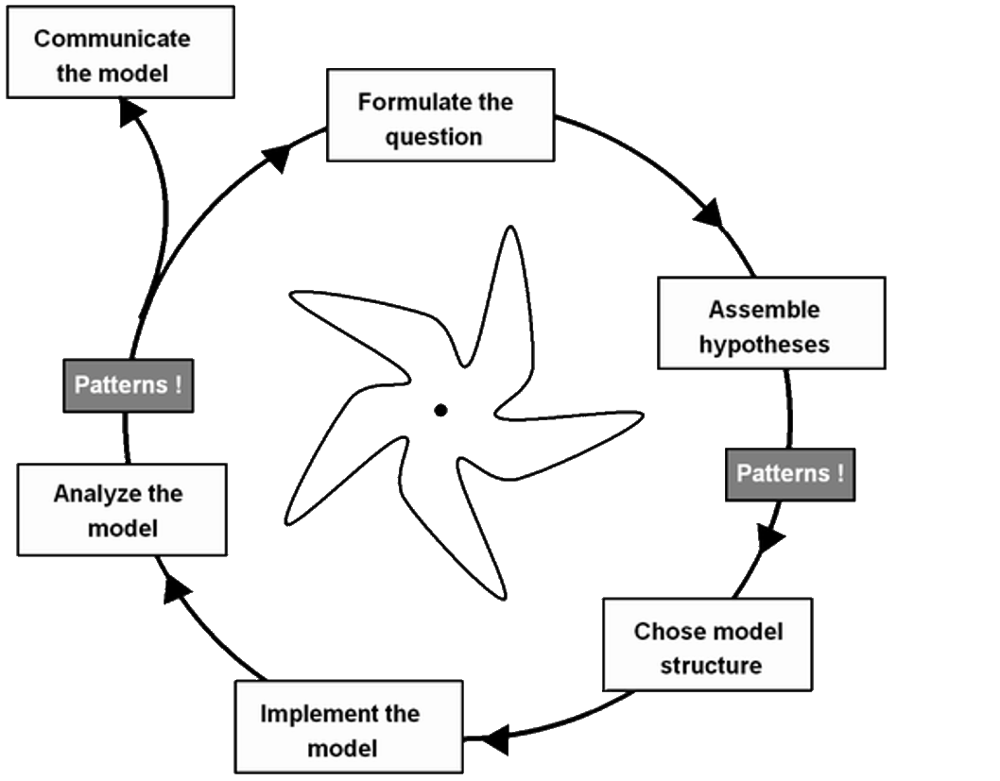
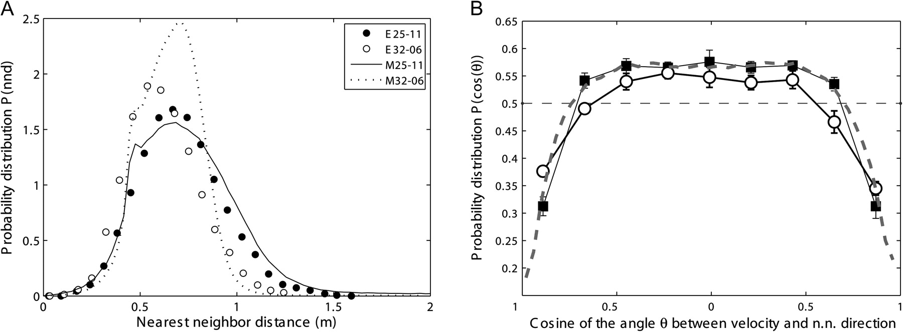
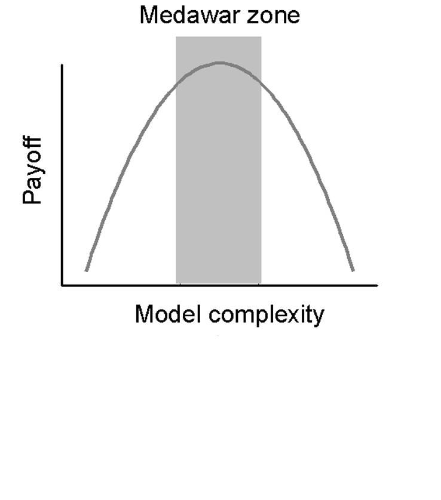
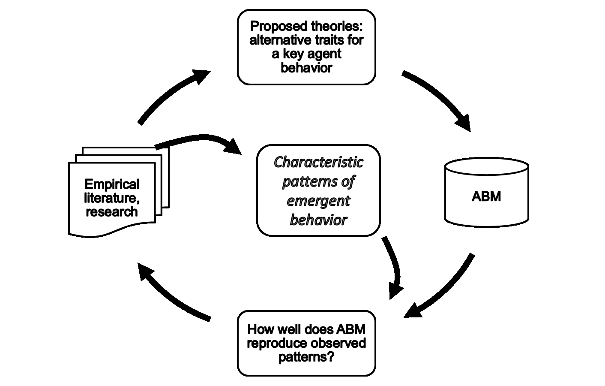
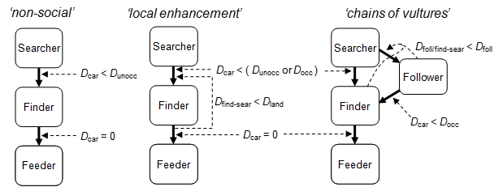
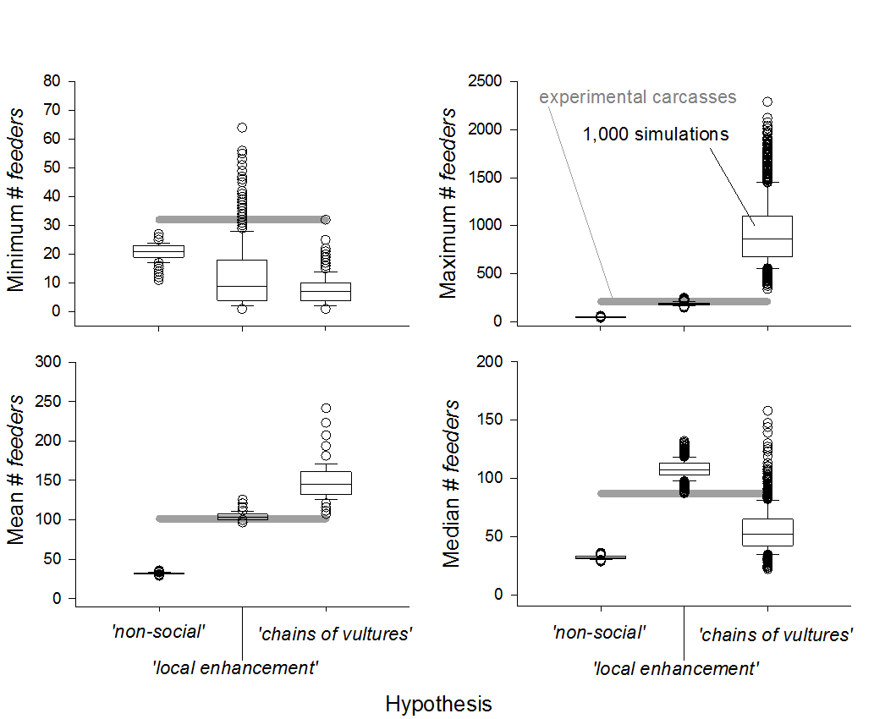
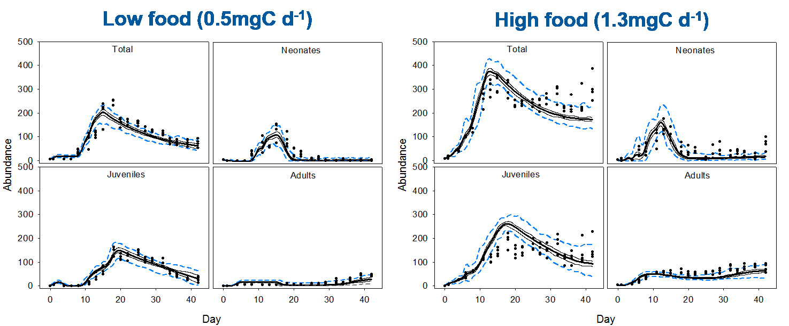
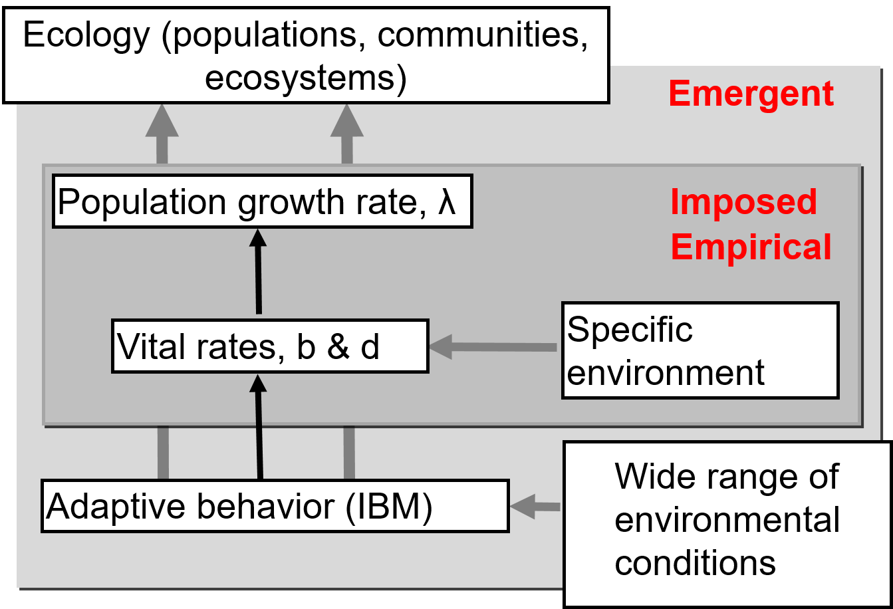
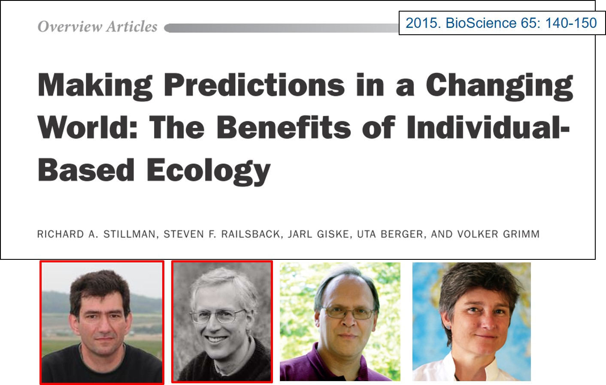

# Pattern-Oriented Modeling {#pattern-sec data-transition="fade-out" data-state="skip_slide"}

## Pattern-Oriented Modeling {#pattern data-transition="fade-in"}

{height=900}

## The Modeling Cycle {#modeling-cycle data-transition="fade-out"}

{height=900}

## The Modeling Cycle {#modeling-cycle-2 data-transition="fade-in"}

{height=900}

# Validatioon and Verification {#validation-sec data-transition="fade-out" data-state="skip_slide" .center}

## Goals of Modeling {#modeling-goals data-transition="fade-in" .center}

* Goals: 
  * Models are "sufficiently good" representations of real counterparts
  * Learn about real world:
    * Capture essential elements of real system's _internal organization_
    * Capture _generative mechanisms_ that produce structure and behavior of real systems

## Problem: Validation and Verification {#validation .center}

* **Version 1:**
  * The model _mimics the real world well enough for its stated purpose_
* **Version 2**
  * We can place confidence in _inferences about real system based on model results_

[E.J. Rykiel "Testing ecological models: The meaning of validation" Ecological Modeling __90__, 229 (1996)]{.small style="margin-top:100px;"}

## Starling Flocks {#starling-flocks .center}

{height=850}

[H. Hildenbrandt _et al._, "Self-organized aerial displays of thousands of starlings: a model," Behav. Ecol. __21__, 1349–-1359 (2010).]{.small style="margin-top:100px;"}

## Validation of Starling Model {#starling-validation .center}

{height=850}

[H. Hildenbrandt _et al._, "Self-organized aerial displays of thousands of starlings: a model," Behav. Ecol. __21__, 1349–-1359 (2010).]{.small style="margin-top:100px;"}

## Fundamental Problem {#fundamental-problem .center}

* Our model might reproduce the _right pattern_ for the _wrong reasons_
* How can we be sure to capture the _real generative mechanisms_?
* How can we design models so that we can _optimize_ model complexity?

## The Medawar Zone {#medawar-zone .center}

:::::: {.columns style="margin-top:50px;"}
::: {.column style="width:50%;vertical-align:top;padding-top:50px;"}

#### P. Medawar: {#medawar-solving}

Optimal level of difficulty for a good research problem:

* Not difficult enough:
  * Result is trivial, uninteresting.
* Too difficult:
  * Unlikely to solve it

:::
::: {.column style="width:50%;"}

{height=750}

:::
::::::

[P. Medawar, _The Art of the Soluble_ (Oxford, 1967)]{.small style="padding-top:50px;"}

## Mechanistically Rich Models {#rich-models .center}

* If model structure is too simple it will not capture essential mechanisms
* There will be too few ways to test the model
* Complexity of model is not bad _per se_ and can increase the payoff

[D.L. De Angelis and W.M. Mooij, "In Praise of Mechanistically Rich Models," in C.D. Canham, J.J. Cole, and W.K. Lauenroth (eds.), _Models in Ecosystem Science_ (Princeton, 2003)]{.small style="padding-top:100px;"}

# Spatial Patterns in Ecology {#spatial-pattern-sec data-transition="fade-out" data-state="skip_slide"}

## Spatial Patterns in Ecology {#spatial-pattern data-transition="fade"}

{height=850}

[<http://www.digitalnaturalhistory.com/images/empetrumnigrumlivedeadwaveforestmistakenpoint.jpg>]{.small style="padding-top:100px;"}

## Spatial Patterns in Ecology {#spatial-pattern-2 data-transition="fade-in"}

{height=850}

[Y. Tremblay, unpublished]{.small style="padding-top:100px;"}

## What Scientists do with Patterns

:::::: {.columns}
::: {.column style="width:50%;"}

{height=800}

:::
::: {.column style="width:50%;vertical-align:top;padding-top:50px;"}

* Pattern: Something beyond random variation
* Pattern contains information about internal organization
* Develop models that reproduce observed pattern
* Inference: Real system's internal mechanisms are like model's
* ___Squeeze___ the pattern!

:::
::::::

## Complex Systems {#complex-systems .center}

* A single pattern may not contain enough information
* Tendency to focus on _single_ patterns observed at _one level_ of observation:
  * Individual Behaviors
  * Population dynamics
  * Community composition

## Monoscopic View {#monoscope .center}

{height=600}

Most approaches (and modelers) are not making
the best use of available information (lemons)

## We Need a Multiscope {#multiscope .center}

{height=800}

## Multiscope View {#multiscope-explained}

* Consider multiple patterns
  * Observed at different scales, levels of organization
* Get model to reproduce multiple patterns simultaneously
* Use each pattern as a _filter_ to reject faulty submodels or parameterizations
* Multiple (3 or more) _weak_ patterns may constrain model better than single _strong_ pattern
* ___Pattern-Oriented Modeling___

## Pattern-Oriented Modeling

{height=900 style="border:0;"}

## Three Elements of Pattern-Oriented Modeling

#. __Design: __ Choose state variables that allow real-world patterns to emerge in models.
#. __Selection:__ Use multiple patterns to compare & reject submodels
#. __Parameterization:__ Use multiple patterns to constrain entire sets of unknown parameters (_inverse modeling_)

## From Theories to Models and Back Again {#theory-cycle}

{height=900}

# Example: Vultures and Carcasses {#vulture-sec .center}

## Vultures Feeding at a Carcass {#vulture-feeding}

{height=800}

## Modeling Vulture Feeding {#vulture-model}

{height=900}
 
[A. Cortes-Avizanda _et al._, "Bird sky networks: How do avian scavengers use social information to find carrion?" Ecology __95__, 1799--1808 (2014)]{.small style="margin-top:0px;padding-top:0px;vertical-align:top;"}

## Interactions among Vultures {#vulture-interactions}

{width=1800}

## Patterns of Feeding {#vulture-patterns-1}

{height=900}

## Model Comparisons {#vulture-patterns-2}

{height=900}

# Impacts of Pesticides on Aquatic Ecosystems {#deb-sec .center}

## Dynamic Energy Budget  Model {#deb-model}

* _Daphnia_ (water flea) population dynamics observed in laboratory
* Previous models focused on details of each species
* Dynamic Energy Budget is generic:
  * Calibrate with known species, apply to new (unknown) species

## Individual Metabolic Energy Balance {#deb-schematic}

{height=900}

## Dynamic Energy Balance Model in NetLogo

::: {.small}
B.T. Martin _et al._, "Predicting Population Dynamics from the Properties of Individuals: A Cross-Level Test of Dynamic Energy Budget Theory", Am. Naturalist __181__, 506--519 (2013)
:::

## Testing the Model

{height=900}

## Different Environmental Conditions

Model reproduces population density and body size distribution at multiple levels of food supply and toxicant exposure

{height=800}

## Dynamical Patterns: Population Cycles

{height=900}

## How Model Fits into Research {#research-framework}

{height=900}

# Pattern-Oriented Process {#pom-process .center}

## Individual-Based Ecology {#ibm-ecology}

{height=900}

## Phase-1: Conceptualization {#conceptualization .center}

* Define research question(s)
  * Determine whether agent-based/individual-based modeling is the right conceptual framework
* Identify link between research question and behavioral mechanisms
* Identify key parameters and processes to represent environment and behavior of the agents (biological species, human actors, etc.)

## Phase-2: Implementation {#implementation .center}

* Start with proof-of-concept:
* Program initial model
  * Ideally, starting model should contain little or no code or submodels specific to a single situation
* Test whether model can produce predictions that are _accurate enough_ to answer research question
* Run sensitivity analysis of model to determine _key parameters and processes_ and relationship between model complexity and predictive power

## Phase-3: Diversification {#diversification .center}

* Simplify model as much as possible by removing unnecessary parameters and processes
* Minimize number of parameters (e.g., global variables) that need to be measured in each new system
  * Derive as many of these as you can from research literature or general relationships
* Parameterize and test simplified model for a wide range of systems to determine limits of approach
* Perform _meta-analysis_ of model runs specific to different sites, or situations
* Use model to test more general theories: gain broadly applicable insights.
