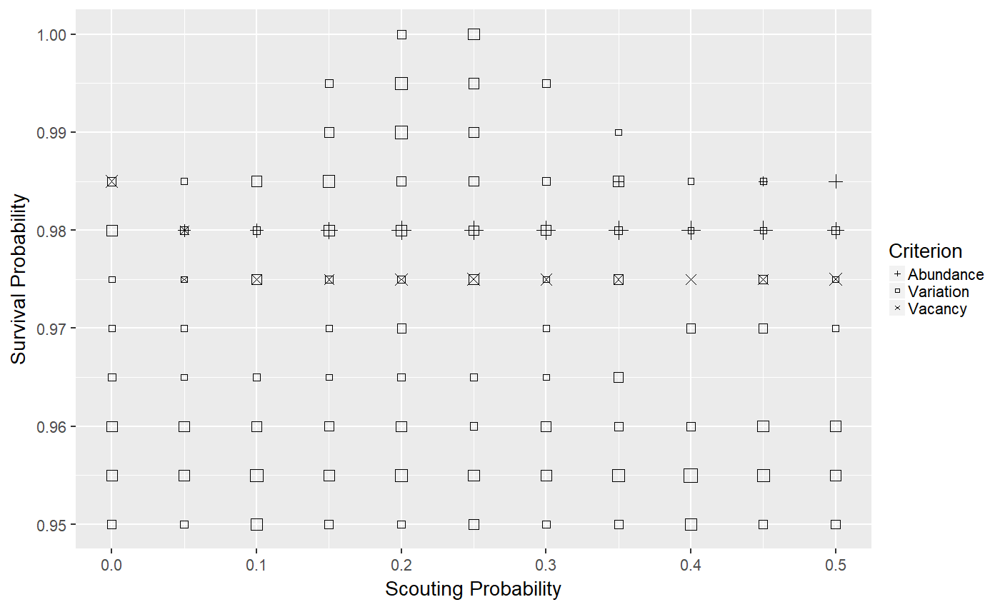
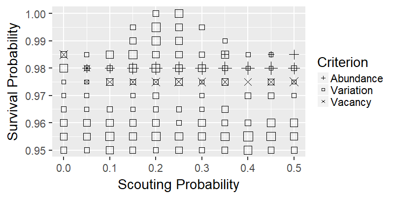
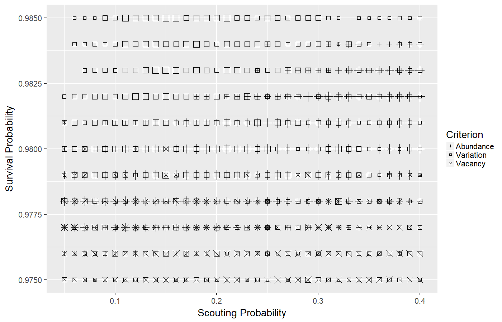
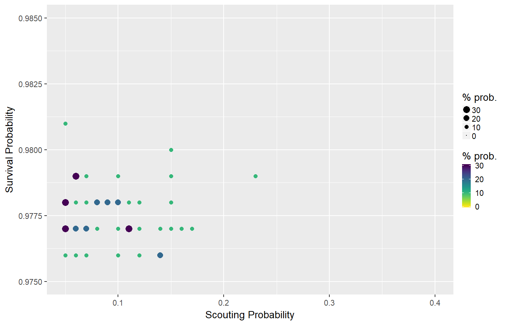

## Download Models and Data

* Zip File: [https://ees4760.jgilligan.org/models/class_22_models.zip](/models/class_22_models.zip)
  * Containing:
    * Wood Hoopoe NetLogo model: [Sect20-5_WoodHoopoes.nlogo](/models/class_22/Sect20-5_WoodHoopoes.nlogo)
    * R Scripts to analyze behaviorspace output:
      * [process_bs.R](/models/class_22/process_bs.R)
      * [analyze_woodhoopoe.R](/models/class_22/analyze_woodhoopoe.R)
    * Behaviorspace output:
      * [Sect20-5_WoodHoopoes Calibration-table.csv](/models/class_22/Sect20-5_WoodHoopoes Calibration-table.csv)
      * [Sect20-5_WoodHoopoes Calibration2-table.csv](/models/class_22/Sect20-5_WoodHoopoes Calibration2-table.csv)

# Vocabulary: {#vocab-sec data-transition="fade-out" data-state="skip_slide"}

## Vocabulary: {#vocab data-transition="fade-in"}

* **Parameterization:** 
  * For many modelers, this means choosing values for parameters.
    * More parameters = more uncertainty (bad)
    * Value parsimony
  * For ABMs, it's different:
    * Many submodels
      * Parameterize and test submodels separately
* **Calibration**
  * A special kind of parameterization
  * Adjust a few important parameters to reproduce patterns observed in real system

# Testing and Calibrating  {#testing-calibrating-sec data-transition="fade-out" data-state="skip_slide"}

## Testing and Calibrating {#testing-calibrating data-transition="fade-in"}

* Test program: Has it been implemented correctly?
* Test submodels: Are they doing what you think they are doing?
* Verificaton: Is the model doing what it's supposed to do?
  * Reproduce patterns, data, observations.
* Understanding: What's going on? Why?
* Validation: Can we find new (independent, secondary) patterns in the model
  that we can test against new observations?

## Theoretical Models

* No data to calibrate from
* "Guesstimate" parameter values from what you do know.
* Perform sensitivity analysis to see how important it is to "get parameters right"

# Challenge {#challenge-sec data-transition="fade-out" data-state="skip_slide"}

## Challenge {#challenge data-transition="fade-in"}

* Model and system are complex
  * We don't know exactly what model is "supposed to do"
* Any pattern in the output could be a *bug* or a *feature*
* Brute-force analysis does not work (you can't try every possible value of each parameter)
* **We need a plan!**

# Master Plan for Analysis  {#master-sec data-transition="fade-out" data-state="skip_slide"}

## Master plan for analysis {#master-plan data-transition="fade-in"}

### Controlled Simulation Experiments

* Controlled = simplify
  * If I kill all individuals, population should be 0
  * If I double mortality rate, population should decrease

## First experiments

* Explain your model to others
* Ask others to look at your model and code
* Graphical, numerical output of entities and state variables
  * Monitors, graphs, print output, save output to a file
  * Use NetLogo inspect feature (right click on a patch or turtle)
* A step button to execute one step at a time
* See what happens

## Test submodels separately

* Create a separate testing model
* Make a controlled environment for your submodel
* For research: Document your testing, keep notes and files

# Patterns  {#pattern-sec data-transition="fade-out" data-state="skip_slide"}

## Patterns {#patterns data-transition="fade-in"}

* Low-level debugging (one line of code at a time) is too slow
* To speed things up, focus on **patterns**
* Analysis means:
  * Tuning parameters, 
  * Turning submodels on and off
  * Observe how patterns change.
* Examples:
  * Population after 48 days
  * Total biomass
  * Variance of turtle size
  * Spatial patterns: are turtles bunched up or spread out?
  * etc.

## Categorical vs. Best Fit

* Best-fit: Numerical data, minimize difference.
  * Best when many real world systems always have same values.
* Categorical:
  * True/False, or ranges of values
  * Best when real-world system has a lot of variation

## Don't panic!

* Finding good patterns to use is **hard**.
* You might need to test many patterns
* You will need multiple patterns
* It is hard work, but it can be fun
* Just as with real experiments, it is important to think creatively.

# Example: Woodhoopoe Model {#woodhoopoe-sec data-transition="fade-out" data-state="skip_slide"}

## Example: Woodhoopoe Model {#woodhoopoe data-transition="fade-in"}

* Use "random scouting" submodel
* Parameters:
  * Survival probability (mortality)
  * Scouting probability (_can't be directly measured in real world_)
* Calibration Criteria
  * Variation in real groups, so _we're not trying to reproduce a specific value_.
    * Categorical calibration
  * Three patterns from field observations:
    #. **Abundance:** Total population in range 115--135 (25 patches)
    #. **Variation** Standard deviation of population from one year to next in range 10--15
    #. **Vacancy** On average, 15--30% of patches missing one or both alphas.

<https://ees4760.jgilligan.org/models/class_23/Sect20-5_WoodHoopoes.nlogo>{style="font-size:80%;"}

## Behaviorspace Experiment

* Monitor `count turtles` and `count patches with [(count turtles-here with [is-alpha?]) < 2]`
* Run for 22 years (264 ticks)
* Vary `scout.prob` from 0.0--0.5 by 0.05
* Vary `survival.prob` from 0.95--1.00 by 0.005
* 121 combinations
* Analyze behaviorspace output file:
  * Throw away first two years (warm-up)
  * Look at month 11 (November, just before breeding)

***

## Interpreting results

> * A few combinations reproduce all three patterns.
> * Abundance pattern only for `survival.prob` = 0.975--0.985
> * Vacancy pattern only for `survival.prob` = 0.975--0.990

***

## Next steps

> * Explore region near `survival.prob` &sim; 0.975--0.985 and `scout.prob` &sim; 0.05--0.40
> * Try changing scouting submodel.

## Detailed Calibration

## Satisfying All Three Criteria

