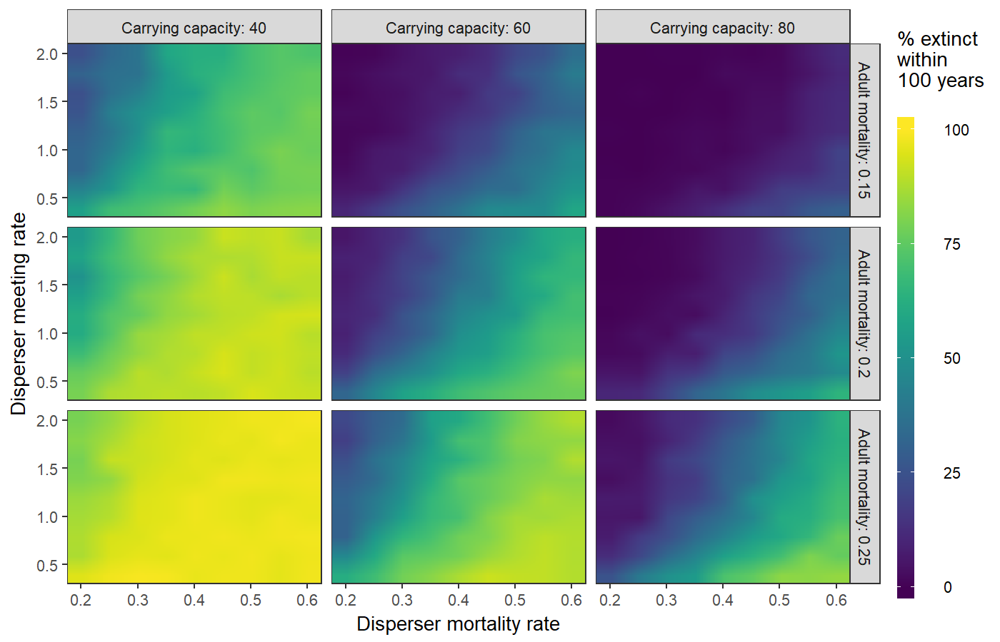

# Sensitivity, Uncertainty, Robustness {#sensitivity-sec .center data-transition="fade-out" data-state="skip_slide"}

## Sensitivity, Uncertainty, Robustness {#sensitivity data-transition="fade-in"}

* Does ABM reproduce patterns **robustly**?
  * or are patterns **sensitive** to specific values for parameters?
* How **uncertain** are the results?
  * What can the model tell us about parameters that we can't measure?
* **Sensitivity Analysis** focuses on small changes in parameters.
* **Robustness Analysis** looks at large changes in parameters.

## Is high sensitivity good or bad?

* **Bad:** If model is testing a general theory, but is very sensitive to parameter
  values, that is evidence *against* the theory.
  
  * Does model work across the entire range of *observed values* for parameters?

* **Good:** If the model is being used to evaluate parameters we can't measure,
higher sensitivity can mean less uncertainty about parameters.

## Challenges: Computational Complexity

* We would like to do *global sensitivity analysis:*
  * Vary all parameters over their entire ranges, in every combination.
  * Can't: computationally unfeasible.
  * There are strategies to make global sensitivity analysis feasible,
    but they are complicated.
* Instead: *local sensitivity analysis:*
  * Small variations around most likely values of parameters.
  * Vary one parameter at a time, or multiple parameters?
    * Interactions
  * Sampling parameter values
    * Random (Monte Carlo)
    * Systematic (e.g., Latin Hypercube)

## Example: Wild Dog Model

* Packs of wild dogs in nature preserve.
* Goal: Keep them from going extinct in next 100 years.
* Vary parameters:
  * Mortality rate of adult dogs in pack
  * Mortality rate of dispersers
  * Meeting rate of disperser groups
  * Carrying capacity

## Analyzing data:

* Contour plots
* "Small multiple" plots
* Analyze four-dimensional data set using a grid of nine plots.

-------

# Example Research Model {#example-research-model-sec .center}

## Example Research Model {#example-research-model .center}

J.J. Jordan *et al.*, "Third-party punishment as a costly signal of trustworthiness," Nature **530**, 473 (2016). [doi:10.1038/nature16981](https://doi.org/10.1038/nature16981)

> * Cooperation and Cheating
>   * Common situation:
>     * Everyone is better off if everyone cooperates than if everyone cheats.
>     * Once everyone else has chosen their action, any individual is better off cheating than cooperating.
>     * Nash equilibrium: Everyone making the best choice for himself produces the worst outcome for everyone.
>     * Opposite of the "invisible hand" in economics.

## Prisoner's Dilemma

|    |  B Cooperates  | B Defects |
|:--:|:----:|:-----:|
| **A Cooperates** |  5, 5  | 0, 7 |
| **A Defects**    |  7, 0  | 1, 1 |

* No matter what player A does, player B is better off defecting
* No matter what player B does, player A is better off defecting
* If both players defect, both are worse off than if both cooperated.

## Tragedy of the commons {.leftslide}

* Ten farmers share a pasture.
* A pasture can support 100 cows.
* If \(N_{\text{cows}} \le 100\), each cow produces $\$1,\!000$ worth of milk per month.
* If \(N_{\text{cows}} > 100\), each cow produces 
    \[\$1,\!000 \times \left(1 - \frac{(N_{\text{cows}} - 100)}{100}\right)\]
    worth of milk per month.
* Each farmer has 10 cows, each farmer earns $\$10,\!000$ per month.

. . .

> * One farmer adds 1 cow: total 101.
>   * Each cow produces \( \$1,\!000 \times (1 - (101 - 100)/100) = \$990 \).
>   * First farmer earns \( 11 \times \$990 = \$10,\!890 \), 
>   * Everyone else earns $\$9,\!900$.
> * Each farmer adds 1 cow: total 110.
>   * Each cow produces $\$900$. Each farmer earns $\$9,\!000$.

## Iterated games

> * If only playing once, best strategy is to cheat, because it is rational for everyone else to cheat.
> * If playing multiple turns, threat of punishment in future rounds promotes cooperation.
> * It is generally costly to punish people.
> * If someone cheats against you, it's often worthwhile to punish them.
> * If you see someone cheating against another person and you aren't affected,
>   is it worth your while to punish the cheater, even if it costs you?
> * Does tragedy of commons inhibit people from punishing?

## Theory {.center}

* Punishment sends a signal:
  * Deters cheaters.
  * Signals that you are trustworthy.

# Game  {#game-sec .center data-transition="fade-out" data-state="skip_slide"}

## Game {#game .center data-transition="fade-in"}

* Player has two roles: Signaler and Chooser
* Signaler can be either Trustworthy or Exploitative.
* Two kinds of signals: Helping or Punishing a third party.
* Two stages:
  1. Signalers can pay costs to send signals.
  2. Choosers decide whether to accept Signalers as partners.
* Cost of signaling can be either small ($s$) or large ($\ell$)

## Payoffs

### Payoffs after second stage are: 

::: {style="margin-bottom:3rem;margin-top:3rem;"}

|  | Trustworthy Signaller | Exploitative Signaller |
|:----:|:----:|:----:|
| Chooser Accepts | $m$, $r$ | $-e$, $r$ |
| Chooser Rejects | 0, 0 | 0, 0 |

:::

* $m$ is benefit of mutual cooperation, 
* $r$ is reward for being trustworthy, 
* $e$ is harm from exploitation.

## Rational strategies

:::::: {.columns}
::: {.column style="width:50%;"}

{style="height:800px;"}

:::
::: {.column style="width:50%;vertical-align:top;padding-top:4rem;"}

* $b$ is _expected benefit_ from trustworthy Signalers
* $c$ is _expected cost_ from exploitative Signalers
* $I_{SH}$ is informativeness of small helping costs
* $I_{SP}$ is informativeness of small punishment costs

:::
::::::

# Agent-based model {#abm-sec .center data-transition="fade-out" data-state="skip_slide"}

## Agent-based model {#abm data-transition="fade-in"}

* Signaler randomly chosen to be Trustworthy or Exploitative.
* Chooser does not know Signaler type
* Evolution of strategies:
  * Each agent plays a certain number of turns (a generation)
  * Agents have probability of reproducing based on earnings from game.
    * Offspring inherit strategy with some random "mutations"

## Outcome of evolution

{style="height:800px;"}
{style="height:800px;"}

# Human Game {#human-game-sec .center data-transition="fade-out" data-state="skip_slide"}

## Human Game {#human-game data-transition="fade-in"}

* Amazon Mechanical Turk (Internet)
* Human players assigned to one of three games:
  * Signaler can only punish.
  * Signaler can only help.
  * Signaler can help and punish.

## Trust Game

* To check whether signals are interpreted accurately by Chooser agents,
  run a second game:
  * Chooser gets some money $M$. 
    * Chooses how much to *send* to Signaler ($x$).
  * Money sent to Signaler is tripled (Signaler get $3x$)
  * Signaler decides how much of the $3x$ to *return* to Chooser.

## Perception of signaling:

{style="height:600px;"}

* Chooser shows trust by sending more money to Signalers who punish and who help.
* Helping is a more powerful signal to Chooser than punishing.
* This matches theory of rational behavior.

## Actual signaliing

{style="height:600px;"}

* Signalers who punish are more trustworthy: return more money to Chooser,
  * But only if helping is not an option.
* Helping is indeed a more accurate signal of trustworthiness.

## Signaler Choice

{style="height:600px;"}

* Signaler is less likely to punish when helping is an option.

## Conclusions

* Evolved strategies of agents match both pure theory (rational strategy) and experimental results.
* It is advantageous for third parties to carry out costly punishments
  when the punishments can signal trustworthiness to others in the community.
* When there are less costly or more effective ways to signal trustworthiness,
  third parties are less likely to punish.

## General ideas about agent-based modeling

> * Model interactions between individuals
>   * Direct: individual-individual
>   * Indirect: individual-environment, environment-individual
> * Focus on emergent properties
>   * Patterns or phenomena that were not deliberately programmed in, but
>     arise spontaneously from interactions of agents with each other and 
>     with environment.
> * Pattern-oriented modeling:
>   * Start simple, but aim to build in enough complexity to produce 
>     multiple patterns seen in nature, or predicted in theory.
>   * As you design model think about what kinds of "currency" you will use
>     to assess its value.
